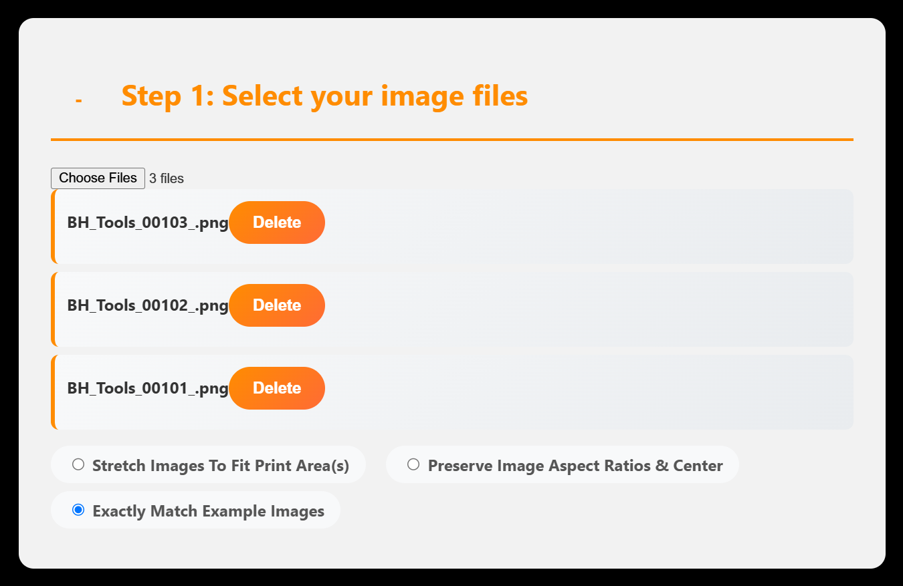
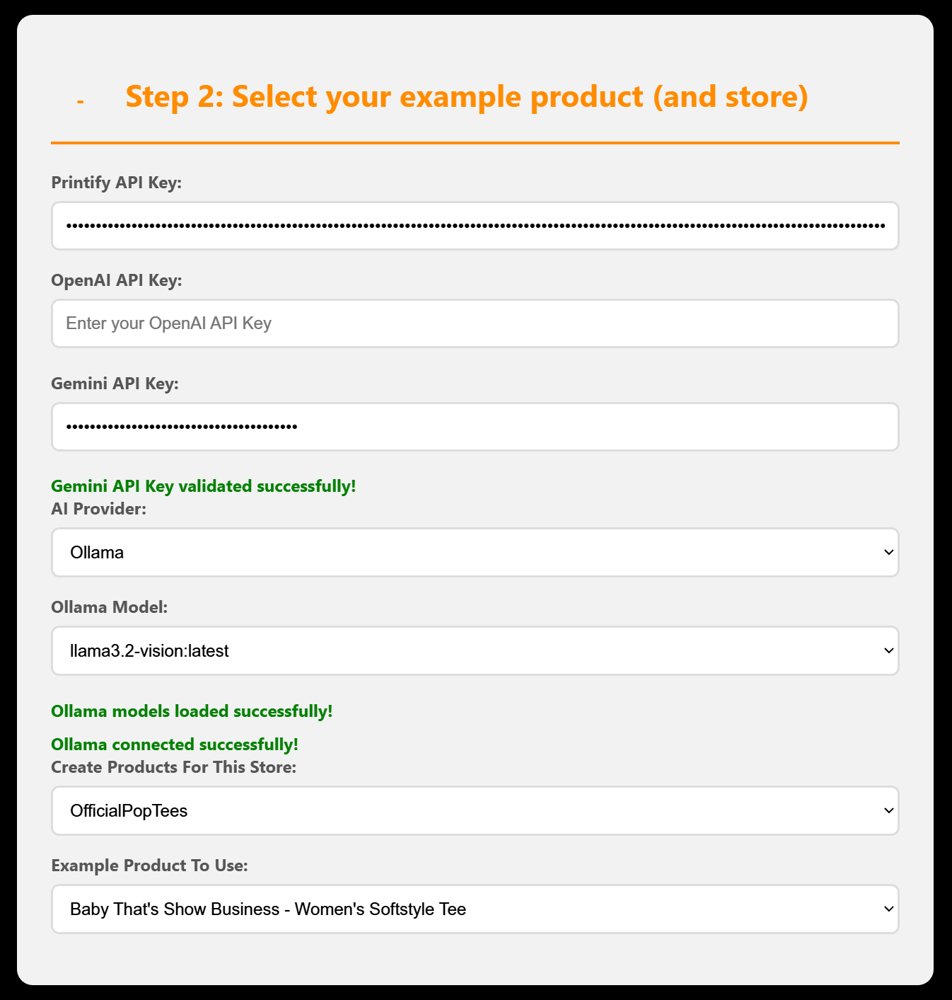

2<a id="top"></a>
<h1 style="color: #FF8C00;">🎬 BHTools: Bulk POD Product Uploader</h1>

[](https://opensource.org/licenses/MIT)
[](https://www.python.org/)
[](https://flask.palletsprojects.com/)
[](https://openai.com/)
[](https://gemini.google.com/)

A web-based tool for bulk uploading and creating print-on-demand products on Printify using AI-generated content with image analysis.

## <span style="color:orange;">🚀 Quick Start</span>

**Get creating products in under 5 minutes:**

1. **Clone**: `git clone <repository-url>`
2. **Install**: `pip install -r requirements.txt`
3. **Run**: `python app.py`
4. **Open**: http://127.0.0.1:5000 in your browser
5. **Configure**: Set your Printify and AI API keys
6. **Upload & Create**: Upload images and generate products!

**For detailed features and customization options, see [Features](#features) below.**

<a id="support-the-project"></a>
## <span style="color:orange;">☕ Support the Project</span>

If you find this Printify Bulk Upload Tool helpful, consider supporting the development:

<p align="left">
  <a href="https://buymeacoffee.com/bhtools" target="_blank">
    
  </a>
  &nbsp;&nbsp;&nbsp;&nbsp;
  <a href="https://www.paypal.com/paypalme/officialbhmedia" target="_blank">
    
  </a>
  &nbsp;&nbsp;&nbsp;&nbsp;
  <a href="https://www.patreon.com/cw/BHTools" target="_blank">
    
  </a>
</p>

## <span style="color: #FF8C00;">📋 Table of Contents</span>

- [🚀 Quick Start](#quick-start)
- [☕ Support the Project](#support-the-project)
- [⬇️ Installation](#installation)
- [🎨 Features](#features)
- [📖 Usage](#usage)
- [📋 Requirements](#requirements)
- [🎬 Uses & Applications](#uses)
- [⚠️ Disclaimer](#disclaimer)
- [📚 Guide & Troubleshooting](#guide)
- [📄 License](#license)

<div align="right">
  <a href="#top">⬆️ Back to Top</a>
</div>

<a id="installation"></a>
<h2 style="color: #FF8C00;">⬇️ Installation</h2>

### Prerequisites
- Python 3.7+
- Printify API key
- OpenAI API key (optional, for AI content generation)
- Google Gemini API key (optional, for AI content generation)

### Installation Steps

1. **Clone the repository**:
   ```bash
   git clone <repository-url>
   cd printify-bulk-upload
   ```

2. **Create a virtual environment** (recommended):
   ```bash
   python -m venv venv
   venv\Scripts\activate  # Windows
   # or
   source venv/bin/activate  # macOS/Linux
   ```

3. **Install dependencies**:
   ```bash
   pip install -r requirements.txt
   ```

3. **Run the application**:
   ```bash
   python app.py
   ```

4. **Access the tool**:
   Open http://127.0.0.1:5000 in your web browser

<div align="right">
  <a href="#top">⬆️ Back to Top</a>
</div>

<a id="features"></a>
<h2 style="color: #FF8C00;">🎨 Features</h2>

- 🖼️ **Bulk Image Upload**: Upload multiple images simultaneously for product creation
- 🤖 **AI-Powered Content Generation**: Use OpenAI GPT-4 Vision, Google Gemini, or local Ollama models for intelligent content creation with automatic HTML formatting
- 👁️ **Image Analysis**: AI vision models analyze uploaded images to generate relevant titles, descriptions, and tags
- 🛒 **Printify Integration**: Seamless connection to Printify API for automated product creation
- 🔑 **Session-Based API Key Management**: Enter your API keys for the current session (keys are not saved persistently)
- 📊 **Real-Time Progress Tracking**: Monitor bulk product creation status with live updates
- 🎨 **Responsive Web Interface**: Clean, modern UI built with HTML, CSS, and JavaScript
- ⚙️ **Flexible Content Rules**: Customize how titles, descriptions, and tags are generated
- 🔄 **Background Processing**: Non-blocking product creation with threading

<div align="right">
  <a href="#top">⬆️ Back to Top</a>
</div>

<a id="usage"></a>
<h2 style="color: #FF8C00;">📖 Usage</h2>

### Basic Workflow

1. **Set API Keys**:
   - Enter your Printify API key
   - Optionally add OpenAI or Gemini API keys for AI features

2. **Select Store & Product**:
   - Choose your Printify store
   - Select an existing product as a template

3. **Configure Rules**:
   - Choose content generation method (AI, filename, or copy from template)
   - Set AI provider preferences
   - Configure title, description, and tag generation rules

4. **Upload Images**:
   - Drag and drop or select multiple image files
   - Supported formats: PNG, JPG, JPEG, GIF

5. **Generate Products**:
   - Review generated content (optional)
   - Start bulk product creation
   - Monitor progress in real-time

### Content Generation Options

#### AI-Generated Content
- **Image Analysis**: AI analyzes each image to understand subject, colors, and style
- **Contextual Titles**: Creates catchy, relevant titles based on image content
- **Detailed Descriptions**: Generates compelling product descriptions with automatic HTML formatting (markdown converted to proper HTML tags)
- **SEO Tags**: Produces relevant tags for better discoverability

#### Fallback Options
- **Filename-Based**: Uses image filename as product title
- **Template Copy**: Copies title, description, and tags from the selected template product

<div align="right">
  <a href="#top">⬆️ Back to Top</a>
</div>


<a id="requirements"></a>
<h2 style="color: #FF8C00;">📋 Requirements</h2>

### Core Dependencies
- **Python 3.7+**
- **Flask**: Web framework
- **Requests**: HTTP library for API calls
- **Werkzeug**: WSGI utility library

### AI Features (Optional)
- **OpenAI**: For GPT-4 Vision content generation
- **Google Generative AI**: For Gemini image analysis
- **Ollama**: For local AI models (vision-capable models required for image analysis)
- **Pillow**: Image processing library

### API Keys Required
- **Printify API Key**: Required for product creation
- **OpenAI API Key**: Optional, enables AI content generation
- **Google Gemini API Key**: Optional, alternative AI provider
- **Ollama**: No API key needed, runs locally (requires vision-capable model)

<div align="right">
  <a href="#top">⬆️ Back to Top</a>
</div>

<a id="uses"></a>
<h2 style="color: #FF8C00;">🎬 Uses & Applications</h2>

### For Print-on-Demand Sellers

#### Bulk Product Creation
- **Art Collections**: Upload entire art series at once
- **Seasonal Products**: Create holiday-themed merchandise quickly
- **Brand Expansion**: Generate products across multiple mockup types

#### Content Optimization
- **SEO-Friendly Titles**: AI-generated titles optimized for search
- **Compelling Descriptions**: Detailed product descriptions that convert
- **Relevant Tags**: Tags that improve product discoverability

### For Artists & Designers

#### Portfolio Management
- **Online Store Setup**: Quickly populate your Printify store
- **Product Line Expansion**: Easily add new designs to existing product types
- **Market Testing**: Rapidly create and test new product ideas

#### Creative Workflow
- **Design to Product**: Streamlined process from artwork to marketplace
- **Batch Processing**: Handle multiple designs simultaneously
- **Quality Control**: Consistent product information across all items

### For Agencies & Teams

#### Client Services
- **White-Label Solutions**: Create products for multiple clients
- **Bulk Operations**: Handle large-volume product creation
- **Quality Assurance**: Consistent branding and product information

#### Workflow Automation
- **Integration Ready**: API-based for custom integrations
- **Progress Monitoring**: Real-time status updates for team coordination
- **Error Handling**: Robust error reporting and recovery

### Technical Integration Examples

#### E-commerce Platforms
- **Shopify Integration**: Sync products across multiple platforms
- **Etsy Automation**: Streamline Etsy shop management
- **Custom Marketplaces**: Integrate with proprietary e-commerce systems

#### Content Management Systems
- **WordPress**: Automate product catalog updates
- **Custom CMS**: Integrate with existing content management workflows
- **API-First Design**: Build custom tools on top of the Printify API

<div align="right">
  <a href="#top">⬆️ Back to Top</a>
</div>

<a id="disclaimer"></a>
<h2 style="color: #FF8C00;">⚠️ Disclaimer</h2>

### Important Legal & Usage Notes

**API Usage & Costs:**
- This tool integrates with third-party APIs (Printify, OpenAI, Google Gemini, Ollama)
- You are responsible for all API usage costs and rate limits
- Ensure compliance with each service's Terms of Service
- Monitor your API usage to avoid unexpected charges
- Ollama runs locally and has no API costs, but requires local hardware resources

**Content Generation:**
- AI-generated content is created using external services and may not always be perfect
- Review and edit generated titles, descriptions, and tags before publishing
- The tool does not guarantee SEO performance or sales results
- Generated content should be used as a starting point, not final copy

**Printify Integration:**
- Products created through this tool follow Printify's standard processes
- You maintain full ownership and control of created products
- Be aware of Printify's product creation limits and guidelines
- Some product types may have additional requirements or restrictions

**Data Privacy:**
- Images are temporarily stored locally during processing
- API keys are managed in session and do not persist across app restarts
- No user data is collected or transmitted to third parties beyond API calls
- Use strong, unique API keys and keep them secure

**No Warranty:**
- This tool is provided "as-is" without warranty of any kind
- The developers are not responsible for any damages or losses
- Use at your own risk and test thoroughly before production use

<div align="right">
  <a href="#top">⬆️ Back to Top</a>
</div>

<a id="guide"></a>
<h2 style="color: #FF8C00;">📚 Guide & Troubleshooting</h2>

### Getting Started Guide

#### Step 1: Obtain API Keys

**Printify API Key:**
1. Go to [printify.com](https://printify.com) and sign in
2. Click your profile → Settings → API
3. Click "Generate API Key"
4. Copy the key (keep it safe!)

**OpenAI API Key (optional):**
1. Go to [platform.openai.com](https://platform.openai.com)
2. Sign up or log in
3. Go to API Keys section
4. Click "Create new secret key"
5. Copy the key (add credits to your account)

**Google Gemini API Key (optional):**
1. Go to [makersuite.google.com](https://makersuite.google.com)
2. Sign in with Google account
3. Click "Get API key" in the sidebar
4. Create a new API key
5. Copy the key



#### Step 2: Setup Your Environment
```bash
# Create virtual environment (recommended)
python -m venv venv
venv\Scripts\activate  # Windows
# or
source venv/bin/activate  # macOS/Linux

pip install -r requirements.txt
```

#### Optional: Setup Ollama for Local AI (Recommended)
If you want to use local AI models instead of OpenAI or Gemini:
```bash
# Install Ollama from https://ollama.ai
# Then run a vision-capable model (one that supports image analysis):
ollama run llama3.2-vision:latest  # Recommended: Has better "influencer" ability for custom prompts
# Or try other vision-capable models like:
# ollama run llava:latest  # More stringent with prompts
# ollama run bakllava:latest  # More stringent with prompts
```

**Note:** The application does not automatically start or manage Ollama. You must run `ollama serve` in a separate terminal window before using Ollama features in the app. If Ollama is not running, requests will fail with connection errors.



#### Step 3: Configure Your Store
- Ensure you have at least one active store in Printify
- Create or select a template product with your desired print specifications
- Note your store ID and template product ID

### Common Issues & Solutions

#### "API Key Required" Error
- **Cause**: Missing or invalid Printify API key
- **Solution**: Double-check your API key in Printify dashboard and ensure it's entered correctly

#### "Failed to Upload Image" Error
- **Cause**: Image format not supported or file corrupted
- **Solution**: Use PNG, JPG, JPEG, or GIF formats under 10MB each

#### "AI API Calls Fail Due to Large Images" Error
- **Cause**: Images exceeding AI API size limits (e.g., OpenAI/Gemini have token limits based on image resolution)
- **Solution**: The tool automatically resizes images to a maximum of 1024x1024 pixels before processing to prevent failures. Ensure original images are under 10MB and high-quality for best results.

#### AI Content Generation Fails
- **Cause**: Invalid AI API key or insufficient credits
- **Solution**: Verify your OpenAI/Gemini API key and check account balance

#### Product Creation Errors
- **Cause**: Invalid template product or Printify API issues
- **Solution**: Ensure template product exists and has valid print areas

#### Performance Issues
- **Cause**: Large number of images or slow internet
- **Solution**: Process images in smaller batches (10-20 at a time)

### Best Practices

#### Content Generation
- **Review AI Content**: Always check generated titles and descriptions for accuracy
- **Customize Templates**: Use the template copy option for consistent branding
- **Test First**: Generate sample content before bulk processing

#### Image Preparation
- **Optimize Images**: Use high-quality images (at least 1000px on longest side)
- **Consistent Naming**: Use descriptive filenames for filename-based titles
- **File Formats**: Stick to PNG/JPG for best results

#### Workflow Optimization
- **Batch Processing**: Process 10-20 images at a time to monitor progress
- **Save Progress**: Note successful uploads in case of interruptions
- **Backup Data**: Keep copies of your original images and API keys

### Advanced Configuration

#### Custom AI Prompts
The AI uses predefined prompts, but you can modify them in the code for custom behavior.

#### Logging
Check the console output for detailed error messages and progress updates.

### Support & Community

- **Issues**: Report bugs on the GitHub repository
- **Feature Requests**: Submit ideas for new functionality
- **Documentation**: Check this README for updates

<div align="right">
  <a href="#top">⬆️ Back to Top</a>
</div>

<a id="license"></a>
<h2 style="color: #FF8C00;">📄 License</h2>

This project is licensed under the MIT License - see the [LICENSE](LICENSE) file for details.

---

**Happy creating! 🖼️✨**

<div align="right">
  <a href="#top">⬆️ Back to Top</a>
</div>
